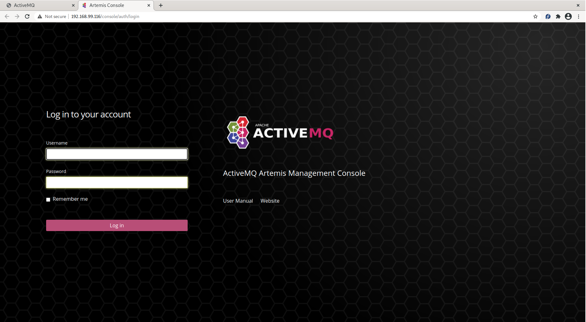
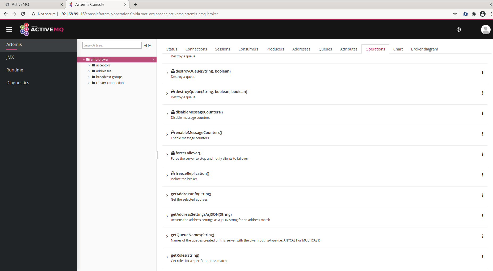

# ArtemisCloud Operator Custom Init Image Example - CREDENTIAL

This example demonstrates how to use custom init image to configure
a broker instance deployed by [ActiveMQ Artemis broker operator](https://github.com/artemiscloud/activemq-artemis-operator) to run in a kubernetes/openshift cluster.

It configures a broker instance to add a new user account to access the broker's management console with limited rights.

This example should not be used in real productization environment.

## About ArtemisCloud Broker Operator Custom Init Image

Users can configure ActiveMQ Artemis Broker via custom resources ([examples](https://github.com/artemiscloud/activemq-artemis-operator/tree/master/deploy/examples)). The available configuration parameters are defined in CRD files.

In cases where users need some peculiar aspects of configuration that may be out of scope of CRD definitions,
they can just provide their own custom init image in the custom resource file. During deployment the operator installs the custom init image in broker's init container so it runs before the broker starts. The custom init image's config script will be called so it can adjust the broker configuration as needed.

## Prerequisites

1. You need to have access to a kubernetes cluster. For example you can install a [minikube](https://minikube.sigs.k8s.io/docs/) cluster.  You also need kubectl tool. In this example we are going to need [ingress](https://kubernetes.io/docs/concepts/services-networking/ingress/) enabled. For minikube you can enable the nginx ingress controller by running this command:

   $ minikube addons enable ingress
 
(You can also choose to use [CodeReady](https://developers.redhat.com/products/codeready-containers/overview))

2. You need to have docker tool available for building the image in the example.

3. You need to have internet access in order to pull/push images in this example.

4. You need a container registry (e.g. [quay.io](https://quay.io) to push your custom init image to and pull it from.

## Example structure

In the current directory there are a few scripts to help you build and run this example.

There are two sub-directories that contains different kind of resources.

- the **custom-init** directory has resources to build the custom init image.
- the **broker** directory contains a broker custom resource file for creating a broker pod with the init image.

## Get started

1. Deploy the Operator. Run:

    `../deploy_broker_operator.sh`

The script sets up proper service account and permissions for the broker operator and deploys the operator.

Verify that the operator is up and running. For example

    $ kubectl get pod
    NAME                                         READY   STATUS    RESTARTS   AGE
    activemq-artemis-operator-554548d4dc-gh9ln   1/1     Running   0          13s

3. Build the custom init image. Run:

    `./build_custom_init.sh <tag>`

You need to pass in your expected tag as an argument to the script.
For example:

    ./build_custom_init.sh quay.io/hgao/custom-init:credential-1.0

The script will build the image, tag it and push it.

The example custom init image will be used in the [broker custom resource file](broker/broker_custom_init.yaml) to configure the broker to add a new account with the following details:

   username: howard
   password: howard
   role: viewer

and the viewer role will only have permissions to execute management operations whose name begin with **list**, **get** and **is**. All other operations are not allowed. 

4. Deploy the broker custom resource. Run

    `./deploy_broker_cr.sh <custom init tag>`

It needs the custom init tag built earlier as it's argument. For example

    `./deploy_broker_cr.sh quay.io/hgao/custom-init:credential-1.0`

The script deploys the broker custom resource **./broker/broker_custom_init.yaml** which uses the custom init image for broker configuration.

Verify that the broker pod is up and running. For example

    $ kubectl get pod
    NAME                                         READY   STATUS    RESTARTS   AGE
    activemq-artemis-operator-554548d4dc-gh9ln   1/1     Running   0          7m34s
    ex-aao-ss-0                                  1/1     Running   0          59s

5. Log in to management console.

The broker custome resource just deployed will expose the console via ingress. First you need find out the ingress details:

    $ kubectl get ingress
    NAME                      CLASS    HOSTS   ADDRESS          PORTS   AGE
    ex-aao-wconsj-0-svc-ing   <none>   *       192.168.99.116   80      7m36s

The **ADDRESS** field of the output is the host ip on which the ingress is exposed. 
Open your browser and go to **http://192.168.99.116** and click on Management Console link to open up the login page. It looks like this:

Use **howard/howard** as username/password to log in. Once logged in you will be able to see various manament resources arranged in a tree/table format.
As we configured the account with some limitations described above, some of the operations are not allowed to execute by the logged in user. To verify just click on the **Artemis/amq-broker** link and then select the **Operations** tab on the top right area and you will get a list of operations. Check on the list and you will find some operations are marked with a **lock** icon which means you don't have permission to perform them. Some others (as configured by the custom init, those whose names begin with **list**/**get**/**is**) are avaiable to use, as shown in the following picture.

To clean up the example, run the following commands:

    $ ./undeploy_broker_cr.sh
    $ ../undeploy_broker_operator.sh

