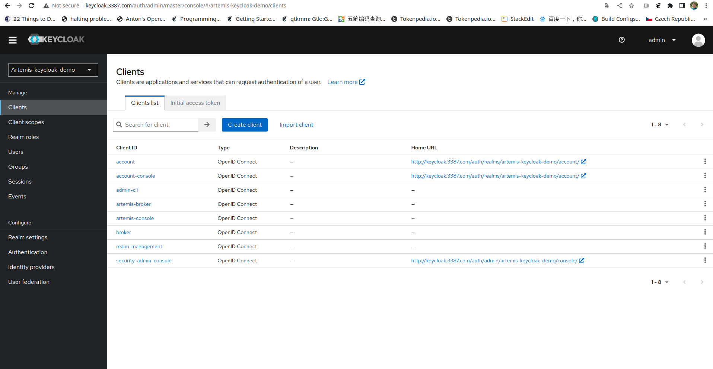
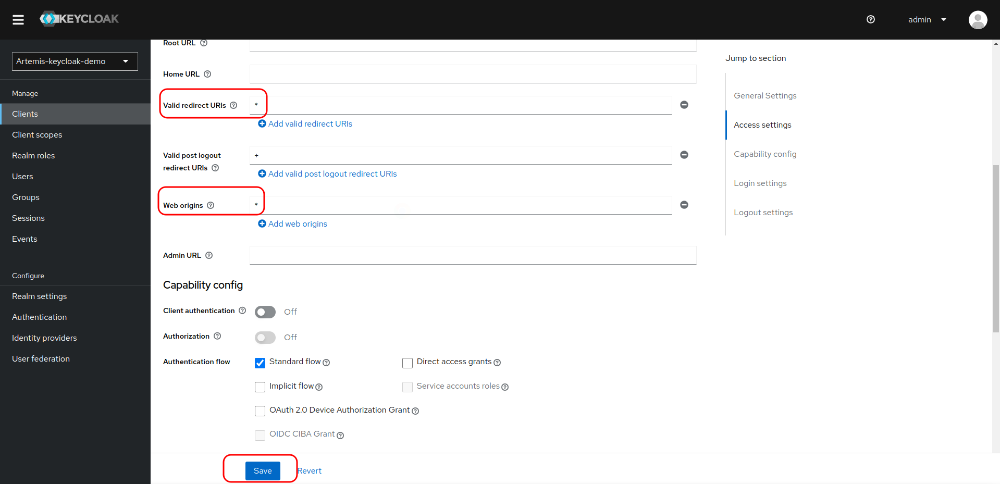

# ArtemisCloud Operator Security Configuration Example - Keycloak Integration

This example demonstrates how to configure security for
an ActiveMQ Artemis broker deployed by [ArtemisCloud operator](https://github.com/artemiscloud/activemq-artemis-operator) to run in a kubernetes/openshift cluster using security custom resources.

The ArtemisCould operator provides a security custom resource definition (CRD) that allows users to configure security for a broker, including

  * JASS login modules for broker and managment console. Currently it supports PropertiesLoginModule, GuestLoginModule and KeycloakLoginModule.
  * Role-based permissions on addresses.
  * Management access control.

This example gives a step-by-step procedure to setup a Keycloak server pod and use it as an authentication server for an ActiveMQ Artemis messaging broker and its management console. It also shows how to configure RBAC based access control for addresses. It is modeled after Apache ActiveMQ Artemis's keycloak example[1]

[1] https://github.com/apache/activemq-artemis/tree/main/examples/features/standard/security-keycloak

## Prerequisites

1. Install [Minikube](https://minikube.sigs.k8s.io/docs/) cluster.  You also need kubectl tool.
   (Note the operator currently works with Minikube v1.21.0 and above)
2. Enable NGINX ingress controller on Minikube [Enable Ingress](https://kubernetes.io/docs/tasks/access-application-cluster/ingress-minikube/)
2. Docker tool for building the image in the example.
3. A [quay.io](https://quay.io) repository for hosting images.

## Step 0 Set up the Keycloak server pod

    `$ cd keycloak`
    `$ ./deploy_keycloak.sh <quay.io user name> <quay.io repo name>`

The build_keycloak.sh performs the following tasks

* Downloading the keycloak distribution and unzip it
* Building the keycloak server image
* Tagging it and push to quay.io
* deploy the keycloak image into Minikube

It takes 2 parameters to execute. The first parameter is your quay.io user name
and the second is your repository name for hosting the keycloak image to build.

For example:

    `$ ./deploy_keycloak.sh hgao keycloak`

The above command will build the keycloak image and tag it as

quay.io/hgao/keycloak/keycloak:latest

and push it to quay.io. Then it deploys the keycloak image into Minikube.

If the deploy_keycloak.sh runs successfully, you will be able to see the Keycloak server pod in the Minikube:

    $ kubectl get pod
    NAME                        READY   STATUS    RESTARTS   AGE
    keycloak-59f74797d5-qdmdb   1/1     Running   0          63m

At the same time an ingress resource is created so that you can access the admin
console of keycloak server.

    $ kubectl get ingress
    NAME               CLASS    HOSTS               ADDRESS          PORTS   AGE
    keycloak-ingress   <none>   keycloak.3387.com   192.168.39.161   80      64m

The ingress above exposes a host 'keycloak.3387.com' as keycloak admin console's
host name. To access the admin console with this host name, add it to the local
/etc/hosts file. i.e. adding the following line to the hosts file.

    192.168.39.161 keycloak.3387.com

Now use your browser to visit http://keycloak.3387.com and click on 'administration
console', log in as admin/admin.

The keycloak server has pre-configured with two users

| User name  | Password | Role  |
| -----------| ---------|-------|
| jdoe       | password | guest |
| mdoe       | password | amq   |

## Step 1 Deploy ArtemisCloud operator

Go to the example root dir and run

    `$ ./deploy_operator.sh`

It will deploy all the CRDs and then the operator. Wait and see the operator is up and running.

    `$ kubectl get pod`
    NAME                                         READY   STATUS    RESTARTS   AGE
    activemq-artemis-operator-5f84687b46-tv957   1/1     Running   0          64m
    keycloak-59f74797d5-qdmdb                    1/1     Running   0          7h12m

## Step 2 Deploy the broker secured by KeycloakLoginModules

Go to the sub-directory **broker** and run

    `$ ./deploy_broker.sh`

It deploys a [security CR](./keycloak-module.yaml) and a broker pod.
The security CR configures the broker with keycloak modules described at
[the Artemis Example](https://github.com/apache/activemq-artemis/tree/2.18.0/examples/features/standard/security-keycloak)

Wait and see the broker pod is up and running:

    `$ kubectl get pod`
    NAME                                         READY   STATUS    RESTARTS   AGE
    activemq-artemis-operator-5f84687b46-tv957   1/1     Running   0          4h16m
    ex-aao-ss-0                                  1/1     Running   0          140m
    keycloak-59f74797d5-qdmdb                    1/1     Running   0          10h

It also deploys an ingress that exposes the broker's management console.

    `$ kubectl get ingress console-ingress`
    NAME              CLASS    HOSTS                 ADDRESS          PORTS   AGE
    console-ingress   <none>   www.mgmtconsole.com   192.168.39.161   80      150m

To allow you to access the management console via the ingress, you need to add the
host www.mgmtconsole.com to /etc/hosts like that:

    192.168.39.161 www.mgmtconsole.com

**Note**

If you open the admin console url **http://www.mgmtconsole.com** and click on
**managment console**, it will redirect you to keycloak's login form. However
you may get errors from keycloak and the login form won't show up.

To fix that you need go to the keycloak's admin console home page, click the
**client** on the left panel and on the right panel:

* select **artemis-console**
* set **valid redirect URIs** to *
* select **Web Origins** to *

and finally click the **save** button. (You need to repeat this step if your keycloak pod is restarted, as it is not persisted)

Now go to broker's admin console and login as jdoe/password.

You shall be able to see the console's home page

The security CR gives some permissions to user **mdoe** and **jdoe** on address **Info** based on their roles. (It also configures some extra permissions on managment address in
order to create the Info queue), summarized as follows:

Permissions of user **jdoe** with role **guest** on addresses:

| Info| activemq.management.# |
| -----|------|
| send |No permissions|

Permissions of user **mdoe** with role **amq** on addresses:

| Info    | activemq.management.# |
| ------- | --------------------- |
| consume | consume |
| createDurableQueue | createAddress |
| deleteDurableQueue | createNonDurableQueue |
| createNonDurableQueue | manage |
| deleteNonDurableQueue | send |

## Step 3 Test sending and receiving

First we need to create a queue named **Info**. We will use user
**mdoe/password** as it has proper permissions to create queues.

Log into the broker pod

    `kubectl exec ex-aao-ss-0 -ti -- /bin/bash`

and run the CLI to create queue

    `[jboss@ex-aao-ss-0 ~]$ ./amq-broker/bin/artemis queue create --name Info --address Info --durable --anycast --silent --auto-create-address --user mdoe --password password --url tcp://ex-aao-ss-0:61616`
    Connection brokerURL = tcp://ex-aao-ss-0:61616
    Queue [name=Info, address=Info, routingType=ANYCAST, durable=true, purgeOnNoConsumers=false, autoCreateAddress=false, exclusive=false, lastValue=false, lastValueKey=null, nonDestructive=false, consumersBeforeDispatch=0, delayBeforeDispatch=-1, autoCreateAddress=false] created successfully.
    [jboss@ex-aao-ss-0 ~]$ exit

Next log into management console using account **jdoe/password**, navigate to queue **Info** and execute the operation sendMessage on it to send a message, like shown in the following screenshot

Log into the broker pod again and receive the message using account **mdoe/password**

    `jboss@ex-aao-ss-0 ~]$ ./amq-broker/bin/artemis consumer --destination queue://Info --message-count 1 --user mdoe --password password --url tcp://ex-aao-ss-0:61616`
    Connection brokerURL = tcp://ex-aao-ss-0:61616
    Consumer:: filter = null
    Consumer ActiveMQQueue[Info], thread=0 wait until 1 messages are consumed
    Consumer ActiveMQQueue[Info], thread=0 Consumed: 1 messages
    Consumer ActiveMQQueue[Info], thread=0 Elapsed time in second : 0 s
    Consumer ActiveMQQueue[Info], thread=0 Elapsed time in milli second : 14 milli seconds
    Consumer ActiveMQQueue[Info], thread=0 Consumed: 1 messages
    Consumer ActiveMQQueue[Info], thread=0 Consumer thread finished
    jboss@ex-aao-ss-0 ~]$ exit
